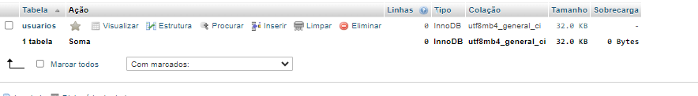

# Cadlog_system

# CadEcommerce

# Índice
[Projeto](#projeto)  
[Descrição](#descrição)  
[Estrutura do Projeto](#estrutura-do-projeto)  
[Funcionalidades](#funcionalidades)  
[Tecnologias utilizadas](#tecnologias-utilizadas)  
[Autores](#autores)  
[Contribuindo no GitHub](#contribuindo-no-github)  
<br>

# Projeto 
O CadLogin-System é um sistema de autenticação de usuários desenvolvido em PHP, que permite realizar o cadastro, login e gerenciamento de usuários. Ele foi criado com a finalidade de servir como exemplo de um sistema de controle de acesso com diferentes perfis de usuário, proporcionando uma solução completa de CRUD (Criar, Ler, Atualizar e Excluir) para pequenas aplicações web.
<br><br>
Disciplina:Programação Web III. <br>
Professor: Leonardo Santiago Sidon da Rocha.

# Descrição


O **Sistema de Gerenciamento de Usuários** é uma aplicação web que permite o registro e autenticação de usuários, gerenciando diferentes perfis de acesso (admin, gestor, colaborador). A interface do sistema foi projetada para ser intuitiva e responsiva, proporcionando uma experiência de usuário fluida.

## Exemplos das Telas

### 1. Tela de Registro de Usuário

Esta tela permite que novos usuários se cadastrem no sistema. O formulário coleta informações como nome, e-mail, senha e perfil, permitindo que você escolha entre as opções de admin, gestor ou colaborador.

**Exemplo de Formulário de Registro:**

   <br>

### 2. Tela de Login

A tela de login permite que usuários registrados acessem o sistema utilizando seu email e senha. Ela inclui um link para a tela de registro, caso o usuário ainda não tenha uma conta.

**Exemplo de Formulário de Login:**

   <br>

### 3. Tela Inicial do Sistema

Após o login, o usuário é direcionado para a tela inicial, onde pode acessar funcionalidades de acordo com seu perfil. Por exemplo, um administrador pode ter acesso a opções de gerenciamento de usuários, enquanto um colaborador pode visualizar suas tarefas.


  **Exemplo de Tela Inicial do gestor:**


  **Exemplo de Tela Inicial do colaborador:**
  

**Exemplo de Tela Inicial do admin:**
Aqui 

   <br>


Após o login, o usuário é direcionado para a tela inicial, onde pode acessar funcionalidades de acordo com seu perfil. Por exemplo, um administrador pode ter acesso a opções de gerenciamento de usuários, enquanto um colaborador pode visualizar suas tarefas.


**Exemplo de Tela Inicial:**


## Banco de Dados

O banco de dados armazena informações dos usuários, incluindo seus nomes, emails, senhas e perfis. 

**Exemplo da Estrutura do Banco de Dados:**

   <br>

# Estrutura do Projeto
1. Banco de Dados
Código:
<br>
sql
CREATE DATABASE sistema_usuarios;

USE sistema_usuarios;

```
CREATE TABLE usuarios (
    id INT AUTO_INCREMENT PRIMARY KEY,
    nome VARCHAR(100) NOT NULL,
    email VARCHAR(100) NOT NULL UNIQUE,
    senha VARCHAR(255) NOT NULL,
    perfil ENUM('admin', 'gestor', 'colaborador') NOT NULL,
    created_at TIMESTAMP DEFAULT CURRENT_TIMESTAMP
);
```
Explicação: A primeira etapa da aplicação envolve a criação do banco de dados sistema_usuarios, onde serão armazenados os dados dos usuários. 
<br><br> A tabela usuarios possui os seguintes campos:
<br>
id: Identificador único do usuário.<br>
* nome: Nome do usuário.<br>
* email: Endereço de email, que deve ser único para cada usuário.<br>
* senha: Senha criptografada do usuário.<br>
* perfil: Tipo de usuário (admin, gestor ou colaborador).<br>
* created_at: Timestamp que registra a data e hora de criação do registro.<br>
<br><br>
2. Conexão com o Banco de Dados.<br>
<br>

     class Database {
     private static $instance = null;

    public static function getConnection() {
        if (!self::$instance) {
            $host = 'localhost';
            $db = 'sistema_usuarios';
            $user = 'root';
            $password = '';

            self::$instance = new PDO("mysql:host=$host;dbname=$db", $user, $password);
            self::$instance->setAttribute(PDO::ATTR_ERRMODE, PDO::ERRMODE_EXCEPTION);
        }
        return self::$instance;
        }
    }
<br>
Explicação: Aqui, implementamos o padrão Singleton para garantir que haja apenas uma instância da conexão com o banco de dados durante toda a execução da aplicação. O método getConnection() usa PDO para se conectar ao banco de dados MySQL, e configura o modo de erro para lançar exceções em caso de problemas, facilitando a depuração.
<br><br>
3. Modelo de Usuário (User Model)
<br>

```

class User {
    public static function findByEmail($email) {
        $conn = Database::getConnection();
        $stmt = $conn->prepare("SELECT * FROM usuarios WHERE email = :email");
        $stmt->execute(['email' => $email]);
        return $stmt->fetch(PDO::FETCH_ASSOC);
    }

    public static function find($id) {
        $conn = Database::getConnection();
        $stmt = $conn->prepare("SELECT * FROM usuarios WHERE id = :id");
        $stmt->execute(['id' => $id]);
        return $stmt->fetch(PDO::FETCH_ASSOC);
    }

    public static function create($data) {
        $conn = Database::getConnection();
        $stmt = $conn->prepare("INSERT INTO usuarios (nome, email, senha, perfil) VALUES (:nome, :email, :senha, :perfil)");
        $stmt->execute($data);
    }
    }
```
Explicação: A classe User representa o modelo de usuário, responsável por interagir diretamente com o banco de dados. Ela possui três métodos:
<br>
findByEmail($email): Busca um usuário pelo email, retornando os dados do usuário ou null se não encontrar.<br>
find($id): Busca um usuário pelo ID.<br>
create($data): Insere um novo usuário no banco de dados utilizando os dados fornecidos (nome, email, senha e perfil).<br><br>
4. Controller de Autenticação (AuthController)<br><br>
```

require_once 'models/user.php';

class AuthController {
    public function login() {
        if ($_SERVER['REQUEST_METHOD'] == 'POST') {
            $email = $_POST['email'];
            $senha = $_POST['senha'];
            $user = User::findByEmail($email);
            
            // Lógica de validação de senha será implementada aqui
        }
    }
}
```
Explicação: A classe AuthController gerencia o processo de login. Ela verifica se o formulário foi enviado via POST, busca o usuário pelo email usando o modelo User, e a validação da senha poderia ser adicionada aqui (por exemplo, utilizando password_verify() para comparar a senha fornecida com a senha criptografada no banco de dados).
<br><br>
5. Controller de Usuário (UserController)<br>


```


class UserController {
    public function register() {
        if ($_SERVER['REQUEST_METHOD'] == 'POST') {
            $data = [
                'nome' => $_POST['nome'],
                'email' => $_POST['email'],
                'senha' => password_hash($_POST['senha'], PASSWORD_DEFAULT),
                'perfil' => $_POST['perfil']
            ];
            User::create($data);
            header('Location: index.php');
        } else {
            include 'views/register.php';
        }
    }
}
```
Explicação:A classe UserController é responsável pelo processo de registro de novos usuários. Ela verifica se a requisição foi enviada via POST, coleta os dados do formulário, criptografa a senha com password_hash(), e usa o método create() da classe User para salvar o novo usuário no banco de dados. Se a requisição for GET, ela carrega a página de registro.
<br><br>
6. Formulário de Registro de Usuário (Front-end)<br>

```
<!DOCTYPE html>
<html lang="en">
<head>
    <meta charset="UTF-8">
    <meta name="viewport" content="width=device-width, initial-scale=1.0">
    <title>Cadastrar-se</title>
    <style>
        /* CSS para estilização da página de registro */
    </style>
</head>
<body>
    <div>
        <h2>Cadastro de Usuário</h2>
        <form action="" method="post">
            <label for="nome">Nome</label>
            <input type="text" name="nome" id="nome" required>

            <label for="email">Email</label>
            <input type="email" name="email" id="email" required>

            <label for="senha">Senha</label>
            <input type="password" name="senha" id="senha" required>

            <label for="perfil">Perfil:</label>
            <select name="perfil" id="perfil">
                <option value="admin">Admin</option>
                <option value="gestor">Gestor</option>
                <option value="colaborador">Colaborador</option>
            </select>
            <button type="submit">Cadastrar</button>
            <a href="">Voltar ao login</a>
        </form>
    </div>
</body>
</html>
```
Explicação: Este é o formulário de registro que será exibido para o usuário. Ele coleta nome, email, senha e perfil (Admin, Gestor ou Colaborador) e os envia ao servidor via POST. O estilo foi configurado para centralizar e melhorar a experiência visual.

7. Formulário de Login (Front-end)

```

<!DOCTYPE html>
<html lang="pt-br">
<head>
    <meta charset="UTF-8">
    <meta name="viewport" content="width=device-width, initial-scale=1.0">
    <title>Entrar</title>
    <style>
        /* CSS para estilização da página de login */
    </style>
</head>
<body>
<main>
    <form method="post" action="index.php?action=login">
        <input type="email" name="email" placeholder="Email" required><br>
        <input type="password" name="senha" placeholder="Senha" required><br>
        <button type="submit">Login</button>
    </form>
    <a href="index.php?action=register">Cadastrar-se</a>
</main>
</body>
</html>
```
Explicação: Esta página permite que os usuários façam login no sistema. Ela coleta o email e a senha e envia os dados ao AuthController via POST. Se o usuário ainda não tiver uma conta, há um link para o formulário de registro.
<br>
Fluxo da Aplicação:<br>
* O usuário acessa a página de login ou registro.<br>
* No registro, os dados são enviados ao UserController, que os insere no banco de dados.<br>
* No login, os dados são enviados ao AuthController, que verifica a existência do usuário e a validade da senha.<br>
* A aplicação utiliza o padrão MVC, onde o Modelo (User) lida com a lógica de interação com o banco de dados, o Controller (AuthController, UserController) lida com o fluxo de entrada e saída de dados, e as Views (formulários) gerenciam a interface com o usuário.<br>

8. Script Principal (index.php)

```
<?php

// Inclui arquivos de controlador para lidar com diferentes ações
require 'controllers/AuthController.php';
require 'controllers/UserController.php';
require 'controllers/DashboardController.php';

// Cria instâncias dos controladores para utilizar seus métodos
$authController = new AuthController();
$userController = new UserController();
$dashboardController = new DashboardController();

// Coleta a ação da URL, se não houver nenhuma ação definida, usa 'login' por padrão
$action = $_GET['action'] ?? 'login';

// Verifica a ação solicitada e chama o método apropriado do controlador
switch ($action) {
    case 'login':
        $authController->login();
        break;
    case 'register':
        $userController->register();
        break;
    case 'dashboard':
        $dashboardController->index();
        break;
    case 'logout':
        $authController->logout();
        break;
    case 'list':
        $userController->list();
        break;
    default:
        $authController->login();
        break;
}
?>
```
Explicação:
Este script atua como o ponto de entrada para a aplicação, gerenciando as requisições e redirecionando para os controladores apropriados com base na ação solicitada na URL.

Conclusão
Essa documentação cobre a estrutura básica da aplicação, incluindo o banco de dados, a lógica de back-end (controladores e modelos) e a interface de usuário (HTML). Você pode expandir esta aplicação adicionando funcionalidades como recuperação de senha, confirmação de email e permissões de acesso mais granular.
<br><br>
9. Página de Dashboard

Código HTML e PHP:

```
<!DOCTYPE html>
<html lang="pt-br">

<head>
    <meta charset="UTF-8">
    <meta name="viewport" content="width=device-width, initial-scale=1.0">
    <title>Dashboard</title>
    <style>
        /* Reset básico */
        * {
            margin: 0;
            padding: 0;
            box-sizing: border-box;
        }

        body {
            font-family: 'Arial', sans-serif;
            background-color: #F0F2F5; /* Cor de fundo consistente */
            display: flex;
            justify-content: center;
            align-items: center;
            height: 100vh;
            padding: 20px;
            margin: 0;
        }

        /* Caixa de conteúdo */
        .container {
            background-color: white;
            padding: 2.5rem;
            border-radius: 12px;
            box-shadow: 0 8px 30px rgba(0, 0, 0, 0.2);
            text-align: center;
            width: 100%;
            max-width: 400px;
            transition: transform 0.3s ease; /* Adicionando transição */
        }

        /* Efeito hover para aumentar a caixa */
        .container:hover {
            transform: scale(1.05);
        }

        /* Título */
        h1 {
            color: #333;
            font-size: 2rem;
            margin-bottom: 1.5rem;
            transition: color 0.3s ease;
        }

        /* Parágrafo */
        p {
            color: #6D6D6D;
            font-size: 1.2em;
            margin-bottom: 20px;
        }

        /* Botão */
        .btn {
            display: inline-block;
            background-color: #333;
            color: white;
            padding: 12px;
            border: none;
            border-radius: 6px;
            cursor: pointer;
            width: 100%;
            font-size: 1.2rem;
            font-weight: bold;
            letter-spacing: 1px;
            transition: background-color 0.3s ease, transform 0.3s ease;
            margin-top: 10px; /* Margem superior */
        }

        /* Efeito hover no botão */
        .btn:hover {
            background-color: #0056b3;
            transform: scale(1.05);
        }

        /* Cores para diferentes perfis */
        body.admin {
            background-color: #FBE7C6;
        }

        body.gestor {
            background-color: #E6E6FA;
        }

        body.colaborador {
            background-color: #FFDDC1;
        }

        /* Link para logout */
        a {
            display: block;
            margin-top: 15px;
            color: #007bff;
            text-decoration: none;
            font-size: 1rem;
            transition: color 0.3s ease, font-size 0.3s ease;
        }

        /* Efeito hover no link */
        a:hover {
            color: #0056b3;
            font-size: 1.05rem;
        }

        /* Animação de transição suave ao abrir */
        @keyframes fadeIn {
            from {
                opacity: 0;
                transform: translateY(-20px);
            }
            to {
                opacity: 1;
                transform: translateY(0);
            }
        }

        .container {
            animation: fadeIn 0.6s ease-out;
        }
    </style>
</head>

<body class="<?=$_SESSION['perfil']?>"> <!-- Define a classe com base no perfil -->
    <div class="container">
        <h1>Bem-vindo, <?=$_SESSION['perfil']?>!</h1>
        <p>Esta é a visão do perfil <?=$_SESSION['perfil']?>.</p>

        <?php if($_SESSION['perfil'] == 'admin'): ?>
            <a href="index.php?action=list" class="btn">Gerenciar Usuários (Admin)</a>
        <?php elseif($_SESSION['perfil'] == 'gestor'): ?>
            <a href="index.php?action=list" class="btn">Gerenciar Usuários (Gestor)</a>
            <p>Área exclusiva do Gestor.</p>
        <?php else: ?>
            <p>Área exclusiva do Colaborador.</p>
        <?php endif; ?>

        <a href="index.php?action=logout" class="btn">Logout</a>
    </div>
</body>

</html>
```
Explicação:
Essa página de Dashboard exibe uma interface dinâmica para os usuários autenticados com base no seu perfil (Admin, Gestor ou Colaborador).

Estrutura HTML: A página usa HTML e PHP embutido para verificar o perfil do usuário via $_SESSION['perfil']. Dependendo do perfil, a página exibe um conteúdo específico:
<br>
Admin: Acesso à gestão de usuários.<br>
Gestor: Acesso à gestão de usuários e uma área exclusiva.<br>
Colaborador: Área exclusiva para colaboradores.<br>

# Atualização do Roteamento
Com essa nova página de Dashboard, o controlador DashboardController deve ser atualizado para garantir que ele carregue essa interface de acordo com o perfil do usuário autenticado.

Controller de Dashboard (DashboardController):

```
class DashboardController {
    public function index() {
        session_start();

        if (!isset($_SESSION['usuario_id'])) {
            header('Location: index.php?action=login');
            exit();
        }

        include 'views/dashboard.php';
    }
}
```
Explicação:
O método index() do DashboardController inicia uma sessão e verifica se o usuário está autenticado. Se o usuario_id não estiver presente na sessão, ele redireciona o usuário para a página de login.
Caso o usuário esteja autenticado, o método inclui a página de Dashboard (dashboard.php), onde o conteúdo é exibido com base no perfil do usuário.

10. Página de Lista de Usuários
Código HTML e PHP:
<br><br>
```
<?php
session_start();

if (isset($_SESSION['perfil'])):
?>

<!DOCTYPE html>
<html lang="pt-br">

<head>
    <meta charset="UTF-8">
    <meta name="viewport" content="width=device-width, initial-scale=1.0">
    <title>Lista de Usuários</title>
    <style>
        /* Reset básico */
        * {
            margin: 0;
            padding: 0;
            box-sizing: border-box;
        }

        body {
            font-family: 'Arial', sans-serif;
            background-color: #F0F2F5; /* Cor de fundo consistente */
            display: flex;
            justify-content: center;
            align-items: center;
            height: 100vh;
            padding: 20px;
            margin: 0;
        }

        .container {
            background-color: white;
            padding: 2.5rem;
            border-radius: 12px;
            box-shadow: 0 8px 30px rgba(0, 0, 0, 0.2);
            width: 100%;
            max-width: 600px;
            text-align: center;
            transition: transform 0.3s ease; /* Adicionando transição */
        }

        /* Efeito hover para aumentar a caixa */
        .container:hover {
            transform: scale(1.05);
        }

        h2 {
            color: #333;
            font-size: 2rem;
            margin-bottom: 1.5rem;
            transition: color 0.3s ease;
        }

        table {
            width: 100%;
            border-collapse: collapse;
            margin: 20px 0;
        }

        th, td {
            padding: 12px;
            text-align: left;
            border-bottom: 1px solid #ddd;
        }

        th {
            background-color: #f2f2f2;
            color: #333;
        }

        /* Estilo das links de ação */
        a {
            color: #007bff;
            text-decoration: none;
            transition: color 0.3s ease;
        }

        a:hover {
            color: #0056b3;
        }

        /* Botão de voltar */
        .btn {
            display: inline-block;
            background-color: #333;
            color: white;
            padding: 12px;
            border: none;
            border-radius: 6px;
            cursor: pointer;
            width: 100%;
            font-size: 1.2rem;
            font-weight: bold;
            letter-spacing: 1px;
            transition: background-color 0.3s ease, transform 0.3s ease;
            margin-top: 20px;
        }

        .btn:hover {
            background-color: #0056b3;
            transform: scale(1.05);
        }

        /* Animação de transição suave ao abrir */
        @keyframes fadeIn {
            from {
                opacity: 0;
                transform: translateY(-20px);
            }
            to {
                opacity: 1;
                transform: translateY(0);
            }
        }

        .container {
            animation: fadeIn 0.6s ease-out;
        }
    </style>
</head>

<body class="<?= $_SESSION['perfil'] ?>"> <!-- Define a classe com base no perfil do usuário -->
    <div class="container">
        <h2>Lista de Usuários</h2>
        <table class="styled-table">
            <thead>
                <tr>
                    <th>ID</th>
                    <th>Nome</th>
                    <th>Email</th>
                    <th>Perfil</th>
                    <th>Ações</th>
                </tr>
            </thead>
            <tbody>
            <?php foreach ($users as $user): ?>
                <tr>
                    <td><?= $user['id'] ?></td>
                    <td><?= $user['nome'] ?></td>
                    <td><?= $user['email'] ?></td>
                    <td><?= $user['perfil'] ?></td>
                    <td>
                        <?php if ($_SESSION['perfil'] == 'admin' || $_SESSION['perfil'] == 'gestor'): ?>
                            <a href="">Editar</a>
                        <?php endif; ?>

                        <?php if ($_SESSION['perfil'] == 'admin'): ?>
                            <a href="">Excluir</a>
                        <?php endif; ?>
                    </td>
                </tr>
            <?php endforeach; ?>
            </tbody>
        </table>

        <a href="index.php?action=dashboard" class="btn">Voltar ao Dashboard</a>
    </div>
</body>

</html>

<?php else: ?>
    <p>Erro: Você não tem permissão para visualizar esta página</p>
<?php endif; ?>
```
<br>
Explicação:
Essa página permite que os administradores e gestores visualizem a lista de usuários e realizem ações, como editar e excluir, dependendo do nível de acesso.

Verificação de sessão:

A página começa com uma verificação de sessão para garantir que o usuário esteja autenticado e tenha um perfil. Se a sessão não contiver o perfil do usuário, uma mensagem de erro é exibida.
Exibição condicional das permissões:
<br><br>
Dependendo do perfil do usuário autenticado (Admin ou Gestor), diferentes ações são permitidas:<br>
Admin: Pode editar e excluir usuários.<br>
Gestor: Pode apenas editar usuários.<br>
Colaboradores: Não têm permissão para editar ou excluir, sendo redirecionados para o Dashboard.<br>

# Atualização no Controlador de Usuários
Essa página deve ser referenciada no UserController para ser carregada corretamente quando o administrador ou gestor desejar visualizar a lista de usuários.

Atualização no UserController:

```
class UserController {
    public function list() {
        session_start();

        if (!isset($_SESSION['usuario_id']) || ($_SESSION['perfil'] != 'admin' && $_SESSION['perfil'] != 'gestor')) {
            header('Location: index.php?action=dashboard');
            exit();
        }

        $users = User::getAll(); // Obtém todos os usuários do banco de dados
        include 'views/list_users.php';
    }
}
```
Explicação:
O método list() do controlador verifica se o usuário está autenticado e se possui o perfil de Admin ou Gestor. Se o perfil for válido, ele carrega a página de lista de usuários (list_users.php).
A função User::getAll() é usada para buscar todos os usuários cadastrados no sistema a partir do banco de dados, e a lista é exibida na tabela da página.


# Funcionalidades


| Método/Comando                               | Descrição                                                                                       | Exemplo                                                      |
|----------------------------------------------|-------------------------------------------------------------------------------------------------|--------------------------------------------------------------|
| [**CREATE DATABASE**](https://www.php.net/manual/pt_BR/sql.create-database.php)                | Cria um novo banco de dados chamado sistema_usuarios.                                        | `CREATE DATABASE sistema_usuarios;`                        |
| [**USE**](https://www.php.net/manual/pt_BR/sql.use.php)                                        | Seleciona o banco de dados sistema_usuarios para operações subsequentes.                     | `USE sistema_usuarios;`                                     |
| [**CREATE TABLE**](https://www.php.net/manual/pt_BR/sql.create-table.php)                      | Cria uma nova tabela chamada usuarios para armazenar informações dos usuários.                | `CREATE TABLE usuarios (...);`                              |
| [**AUTO_INCREMENT**](https://www.php.net/manual/pt_BR/sql.auto-increment.php)                  | Define que o campo id é incrementado automaticamente para cada novo registro.                | `id INT AUTO_INCREMENT PRIMARY KEY`                          |
| [**VARCHAR**](https://www.php.net/manual/pt_BR/sql.varchar.php)                                | Define o tipo de dados como uma string de comprimento variável, com tamanho máximo especificado. | `nome VARCHAR(100) NOT NULL`                                |
| [**UNIQUE**](https://www.php.net/manual/pt_BR/sql.unique.php)                                  | Garante que os valores da coluna email sejam únicos na tabela.                               | `email VARCHAR(100) NOT NULL UNIQUE`                        |
| [**ENUM**](https://www.php.net/manual/pt_BR/sql.enum.php)                                     | Define uma lista de valores permitidos para a coluna perfil.                                 | `perfil ENUM('admin', 'gestor', 'colaborador') NOT NULL`   |
| [**TIMESTAMP**](https://www.php.net/manual/pt_BR/sql.timestamp.php)                            | Cria um registro da data e hora em que o usuário foi criado.                                 | `created_at TIMESTAMP DEFAULT CURRENT_TIMESTAMP`           |
| [**require_once**](https://www.php.net/manual/pt_BR/function.require.php)                      | Inclui e executa um arquivo específico, como database.php ou user.php.                      | `require_once 'models/database.php';`                       |
| [**class**](https://www.php.net/manual/pt_BR/language.oop5.basic.php)                         | Define uma nova classe, como Database ou User, que encapsula métodos e propriedades.         | `class User {...}`                                         |
| [**private static \$instance**](https://www.php.net/manual/pt_BR/language.oop5.basic.php)     | Variável estática privada que armazena a única instância da classe para conexão com o banco de dados. | `private static $instance = null;`                          |
| [**public static function getConnection()**](https://www.php.net/manual/pt_BR/language.oop5.basic.php) | Método estático que retorna a conexão com o banco de dados, garantindo uma única instância. | `public static function getConnection() {...}`             |
| [**PDO**](https://www.php.net/manual/pt_BR/book.pdo.php)                                      | Classe PHP Data Objects para conexão com o banco de dados MySQL.                             | `new PDO("mysql:host=$host;dbname=$db", $user, $password);` |
| [**setAttribute()**](https://www.php.net/manual/pt_BR/pdo.setattribute.php)                    | Define o modo de erro para exceções, facilitando a depuração e tratamento de erros.          | `self::$instance->setAttribute(PDO::ATTR_ERRMODE, PDO::ERRMODE_EXCEPTION);` |
| [**public static function findByEmail(\$email)**](https://www.php.net/manual/pt_BR/language.oop5.basic.php) | Método que localiza um usuário pelo email no banco de dados.                                  | `public static function findByEmail($email) {...}`         |
| [**prepare()**](https://www.php.net/manual/pt_BR/pdo.prepare.php)                              | Prepara uma instrução SQL para execução.                                                      | `$stmt = $conn->prepare("SELECT * FROM usuarios WHERE email = :email");` |
| [**execute()**](https://www.php.net/manual/pt_BR/pdo.execute.php)                              | Executa a instrução SQL preparada.                                                            | `$stmt->execute(['email' => $email]);`                     |
| [**fetch()**](https://www.php.net/manual/pt_BR/pdo.fetch.php)                                  | Recupera a próxima linha de um conjunto de resultados, retornando-a como um array associativo. | `return $stmt->fetch(PDO::FETCH_ASSOC);`                   |
| [**public static function find(\$id)**](https://www.php.net/manual/pt_BR/language.oop5.basic.php) | Método que localiza um usuário pelo ID no banco de dados.                                     | `public static function find($id) {...}`                   |
| [**public static function create(\$data)**](https://www.php.net/manual/pt_BR/language.oop5.basic.php) | Método que insere um novo usuário no banco de dados.                                          | `public static function create($data) {...}`               |
| [**public function login()**](https://www.php.net/manual/pt_BR/language.oop5.basic.php)        | Método que processa o login do usuário.                                                       | `public function login() {...}`                             |
| [**\$_SERVER['REQUEST_METHOD']**](https://www.php.net/manual/pt_BR/reserved.variables.php)     | Verifica o método da requisição HTTP (GET ou POST).                                           | `if (\$_SERVER['REQUEST_METHOD'] == 'POST') {...}`         |
| [**password_hash()**](https://www.php.net/manual/pt_BR/function.password-hash.php)            | Criptografa a senha do usuário antes de armazená-la no banco de dados.                        | `'senha' => password_hash($_POST['senha'], PASSWORD_DEFAULT)` |
| [**header()**](https://www.php.net/manual/pt_BR/function.header.php)                           | Redireciona para outra página após uma operação, como após o registro de um usuário.          | `header('Location: index.php');`                           |
| [**include**](https://www.php.net/manual/pt_BR/function.include.php)                           | Inclui um arquivo PHP, como uma view para exibir um formulário de registro.                  | `include 'views/register.php';`                             |


# Tecnologias utilizadas

`PHP`: Linguagem de programação utilizada para o back-end, gerenciando a lógica de controle e interação com o banco de dados.<br><br>
`MySQL`: Banco de dados relacional usado para armazenar e gerenciar os dados dos usuários.<br><br>
`HTML/CSS`: Estrutura e estilização das páginas de interface com o usuário.<br><br>
`JavaScript`: Utilizado para melhorar a experiência do usuário, com validações e interações dinâmicas no front-end.<br><br>
`Apache/Nginx`: Servidores web compatíveis para rodar o sistema.<br><br>

#Autores
<br>
Aluna: <br>
<br>
  Isabelle Nascimento de Oliveira <br>
<br>

* Professor Leonardo Santiago Sidon da Rocha.

# Contribuindo no GitHub

**Se você encontrou um problema, deseja sugerir melhorias ou simplesmente quer dar um feedback sobre o projeto, você pode contribuir fazendo um fork do repositório. Após fazer o fork, você pode:**

1. Fazer as modificações necessárias no seu repositório.
2. Enviar um pull request para o repositório original.

Agradeco sua contribuição!
